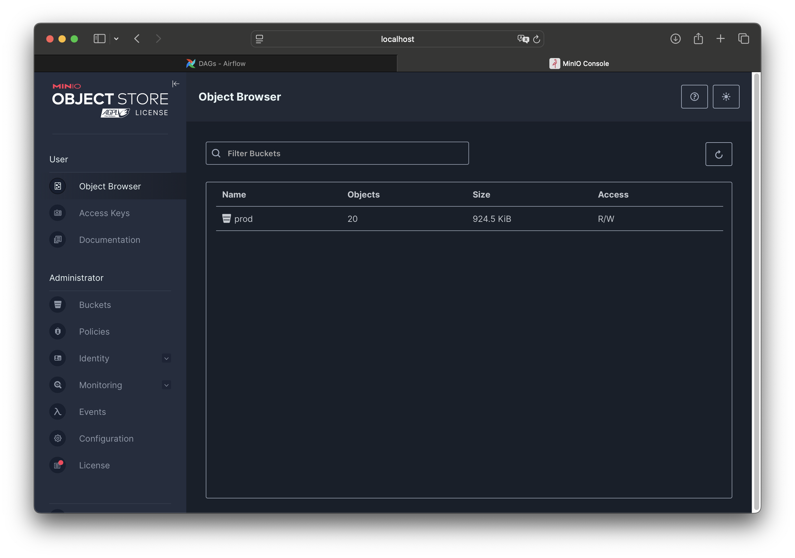
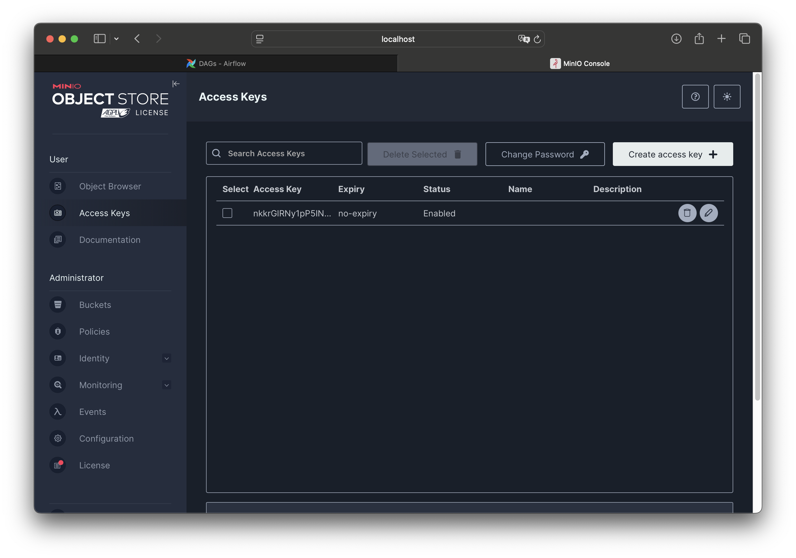
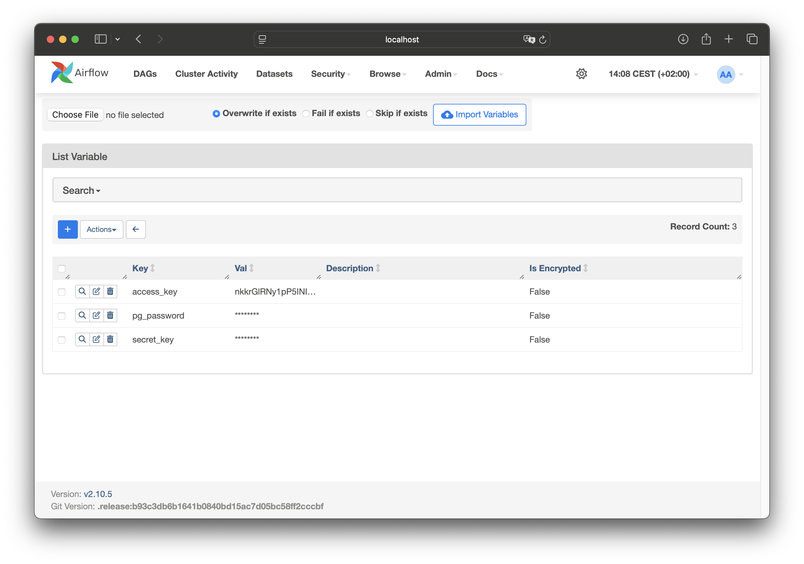
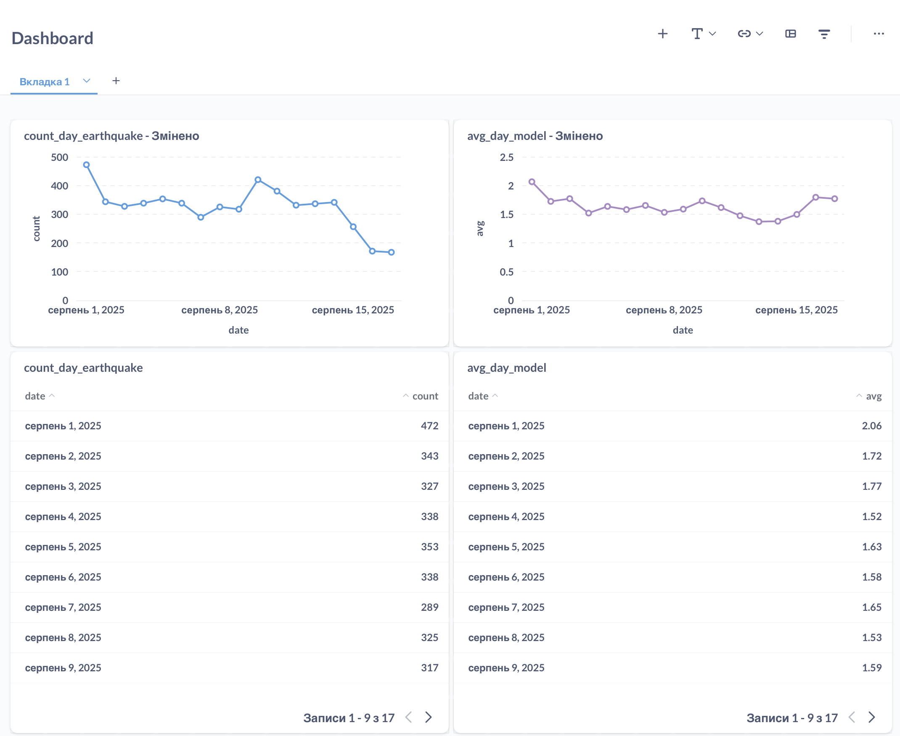

# Earthquake Data Lakehouse

A simple **data lakehouse** pipeline for earthquake data.  
It ingests raw data from an external API into **MinIO (S3)**, loads it into **PostgreSQL** (schemas: `stg`, `ods`, `dm`), and builds daily analytics with **Apache Airflow** DAGs (`avg_day`, `count_day`).

## Overview

- **Ingestion:** Airflow DAG `raw_from_api_to_minio` fetches raw earthquake data from the API and stores it in a MinIO bucket.  
- **Load to DB:** Airflow DAG `raw_from_minio_to_pg` transfers data from MinIO to PostgreSQL and ensures schemas `stg`, `ods`, `dm` exist.  
- **Analytics:** Two DAGs compute daily aggregates: `avg_day` (daily averages) and `count_day` (daily counts).

## Technologies

- Python (virtualenv + pip)
- DuckDB 1.2.2
- Apache Airflow (workflow orchestration)  
- MinIO (S3-compatible object storage)  
- PostgreSQL  
- Docker & Docker Compose  
- Metabase (optional dashboards)  

## Setup Instructions

### 1) Clone and install dependencies
```bash
git clone https://github.com/dmytroLysh/data_lakehouse_Earthquake.git
cd data_lakehouse_Earthquake

# Create & activate venv (Linux/Mac)
python3.12 -m venv venv
source venv/bin/activate

# Windows PowerShell
# python -m venv venv
# .\venv\Scripts\Activate.ps1

# Install dependencies
pip install -r req.txt
```

### 2) Start services
```bash
docker-compose up -d
```

**Default UIs (if not changed in `docker-compose.yaml`):**
- Airflow → http://localhost:8080  
- MinIO → http://localhost:9000  
- PostgreSQL → port `5432`  
- Metabase (optional) → http://localhost:3000  

## MinIO Setup

Before running the ingestion DAG:

1. Open **MinIO Console** → http://localhost:9000  
2. Sign in with **root credentials** from `docker-compose.yaml`  
3. **Create a bucket**, e.g. `prod`

_Screenshot placeholder:_  

  
5. **Create access keys**:  
   - Go to **Identity → Service Accounts**  
   - Create a new service account  
   - Save:
     - `ACCESS_KEY`  
     - `SECRET_KEY`
    
_Screenshot placeholder:_  


## Airflow Setup

In **Airflow UI**:

### Variables (Admin → Variables)  
Create these variables (names are case-sensitive and must match your DAG code):

- `Access_key`  
- `secret_key`  
- `pg_password`  e.g. `postgres`  

_Screenshot placeholder:_  


### Connection (Admin → Connections)  
Create **one Postgres connection** used by the DAGs (e.g., `postgres_dwh`):

- **Conn Id:** `postgres_dwh`  
- **Conn Type:** `Postgres`  
- **Host:** `postgres` (or your DB host)  
- **Schema:** your database name  
- **Login:** `postgres` (or your DB user)  
- **Password:** value of `pg_password` variable  
- **Port:** `5432`  

## Running the DAGs

1. **Ingestion (API → MinIO)**  
   Trigger `raw_from_api_to_minio` to fetch raw earthquake data and store it in the MinIO bucket.  

2. **Load to PostgreSQL (MinIO → Postgres)**  
   Trigger `raw_from_minio_to_pg` to read from MinIO and load data into PostgreSQL schemas:  
   - `stg` — staging/raw  
   - `ods` — operational data store  
   - `dm` — data mart  

3. **Analytics**  
   Trigger:  
   - `avg_day` — daily averages  
   - `count_day` — daily counts  

**Recommended order:** `raw_from_api_to_minio` → `raw_from_minio_to_pg` → `avg_day` & `count_day`.

## Metabase (Optional)

If Metabase is enabled in `docker-compose.yaml`, connect it to the PostgreSQL service and build dashboards from the `dm` schema.

_Screenshot placeholder:_  


## Notes

- **Do not commit real credentials.** Keep secrets in Airflow Variables or MinIO service accounts.  
- Ensure your **bucket name** and **Airflow Variable names** match what the DAGs expect.  

